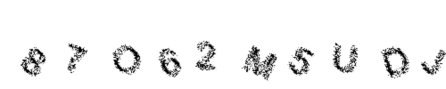

<div align="center">


**Captcha-Gen** is a `text-to-image` captcha generator.

</div>

## **Installation**

**Using** _`poetry`_

```
git clone https://github.com/x404xx/Captcha-Gen.git
cd Captcha-Gen
poetry shell
poetry install
```

**Using** _`pip`_

```
git clone https://github.com/x404xx/Captcha-Gen.git
cd Captcha-Gen
virtualenv env
env/scripts/activate
pip install -r requirements.txt
```

## Usage

```
usage: python -m captcha_gen [-h] [-l LENGTH]

Generate text-to-image captcha.

options:
  -h, --help            show this help message and exit
  -l LENGTH, --length LENGTH
                        The length of the captcha text to generate. Defaults to 6.
```

## Usage Example

```
python -m captcha_gen -l 10
```

## Output



## **Legal Disclaimer**

> [!Note]
> This was made for educational purposes only, nobody which directly involved in this project is responsible for any damages caused. **_You are responsible for your actions._**
